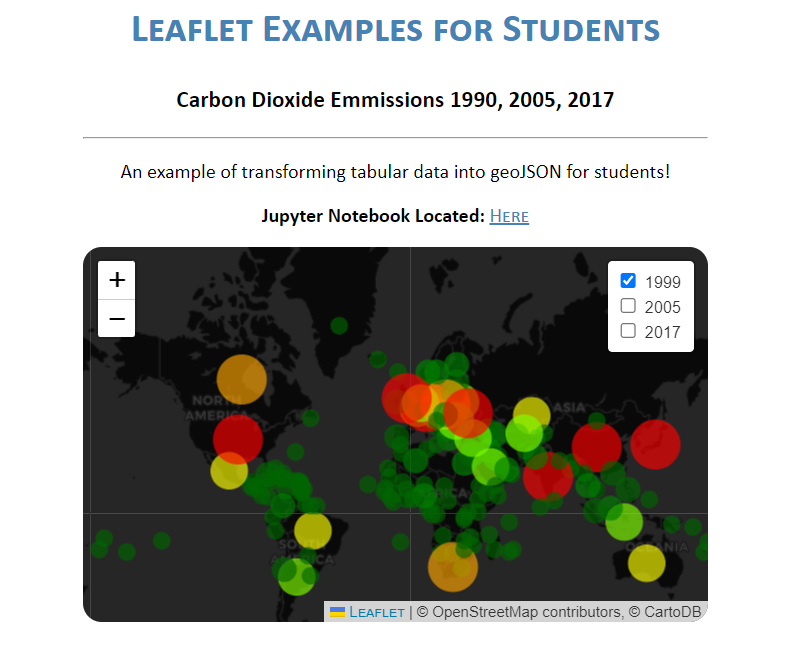

# TUTORING : TABULAR DATA TO GEOJSON

## LINK TO LIVE

You can see the GeoJSON displayed [here](https://de-mark.github.io/tutoring__tabular_to_geojson/).

You can see the notebook for translating the table to geoJSON [here](https://github.com/de-mark/tutoring__tabular_to_geojson/blob/main/02__tabular_to_geojson.ipynb).





## DATA SET SOURCES

__co2_emissions.csv__ [Kaggle: Countries By Carbon Dioxide Emissions](https://www.kaggle.com/datasets/rajkumarpandey02/countries-by-carbon-dioxide-emissions)

__countries.csv__ [GitHub : metal3d gist](https://gist.github.com/metal3d/5b925077e66194551df949de64e910f6)


## EXPLANATION

Leaflet and other geographic display data often work better if your data is in geoJSON format. Remember, [geoJSON is a strictly organized JSON](https://geojson.org/) so it's organized in the same way every time.

Remember, in RFC 7946, each marker follows the following structure: 

```
{
  "type": "Feature",
  "geometry": {
    "type": "Point",
    "coordinates": [125.6, 10.1]
  },
  "properties": {
    "name": "Dinagat Islands"
  }
}
```

We can transform our tabular data into this format.

__CREATING THE DATA__ Can be found [here](https://github.com/de-mark/tutoring__tabular_to_geojson/blob/main/01__building_initial_tabular_data.ipynb)

__TURNING THE TABULAR DATA INTO GEOJSON__ Can be found [here](https://github.com/de-mark/tutoring__tabular_to_geojson/blob/main/02__tabular_to_geojson.ipynb)
